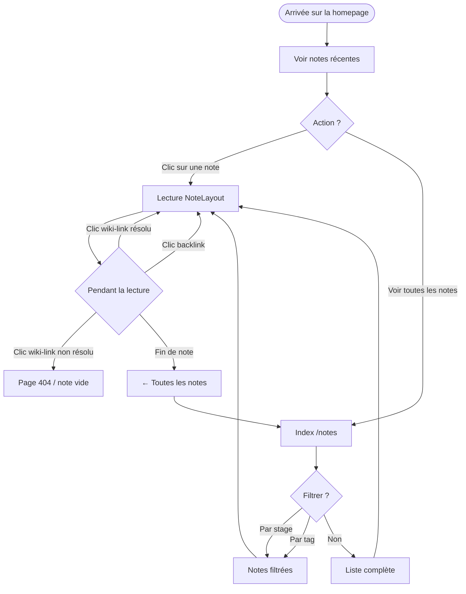
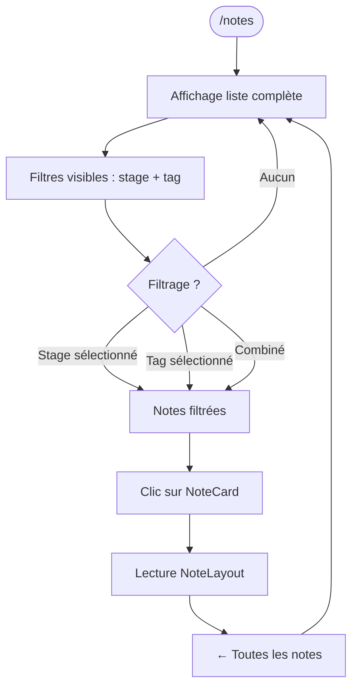
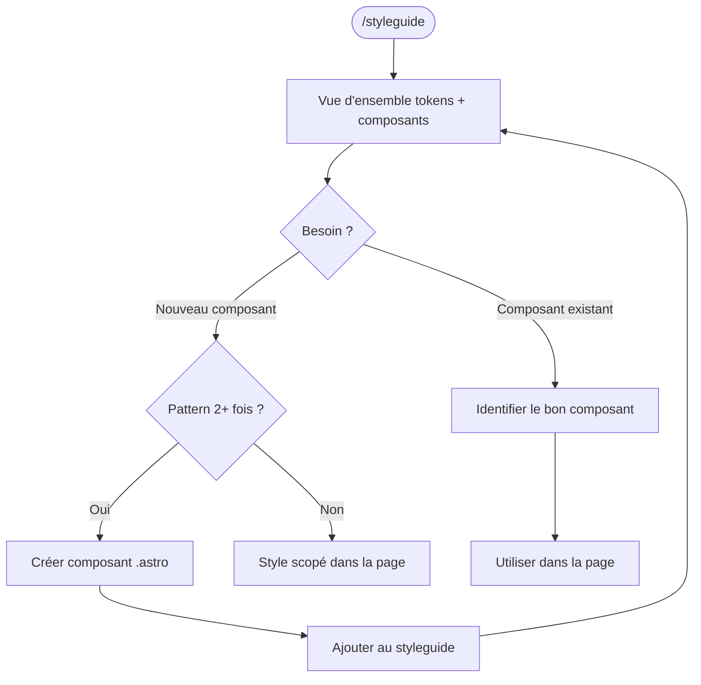

# UX Design Specification — digitalgarden

**Auteur :** Cyril
**Date :** 2026-04-13

---

<!-- UX design content will be appended sequentially through collaborative workflow steps -->

## Executive Summary

### Project Vision

Digitalgarden est un jardin numérique personnel auto-hébergé (Astro 6 + Tailwind v4, déployé sur homelab via Syncthing + systemd + SWAG). La v1 de cette phase est une refonte architecturale du design system : formaliser les tokens CSS, extraire une bibliothèque de composants Astro, et créer une page `/styleguide` comme documentation vivante. Le style visuel existant est conservé à l'identique.

### Target Users

Utilisateur unique : Cyril. Développeur auto-hébergeur, familier d'Astro. Besoin principal : reprendre le projet après des semaines d'absence sans devoir déchiffrer du CSS éparpillé. Critère de succès = confiance dans le code.

### Key Design Challenges

- **Cohérence sans régression** : produire un rendu pixel-perfect identique à l'actuel tout en restructurant le code
- **Découvrabilité** : la page `/styleguide` doit rendre la bibliothèque de composants immédiatement lisible
- **Convention durable** : la règle d'extraction (2 usages → composant) doit être suffisamment claire pour éviter toute zone grise future

### Design Opportunities

- **Tokens sémantiques** (rôle plutôt que valeur) : prépare le dark mode sans refactoring ultérieur
- **Page `/styleguide` dès v1** : chaque futur composant a un endroit naturel de référence
- **Rythme typographique formalisé** : protège l'expérience de lecture existante contre toute dérive

## Core User Experience

### Defining Experience

Deux rôles coexistent pour l'utilisateur unique (Cyril) :

- **Lecteur** : naviguer les notes publiées de façon fluide, suivre les wiki-links sans friction, filtrer par stage ou tag naturellement.
- **Mainteneur** : reprendre le projet après une absence, comprendre immédiatement la structure, ajouter un composant ou une page sans créer de nouvelle dette CSS.

L'expérience centrale n'est pas l'interface — c'est la **confiance dans le code**. Un site dont on n'a pas honte de rouvrir.

### Platform Strategy

- **Web uniquement** — site statique servi depuis homelab (Nginx/SWAG)
- **Desktop-first** — usage personnel sur poste de travail, souris + clavier
- **Pas d'offline** — static SSG, pas de PWA nécessaire
- **Responsive utile** — le site peut être visité occasionnellement sur mobile, mais ce n'est pas le cas d'usage prioritaire

### Effortless Interactions

- **Navigation entre notes** : les wiki-links `[[slug]]` doivent être visuellement distincts et clairement cliquables
- **Découverte des composants** : `/styleguide` doit permettre de voir d'un coup d'œil tous les éléments disponibles, avec leurs variantes
- **Ajout de contenu** : écrire dans Obsidian → sync automatique → rebuild → publié. Zéro friction éditoriale.
- **Extension du design system** : ajouter un composant doit avoir un chemin évident (créer le `.astro`, l'ajouter au styleguide)

### Critical Success Moments

- **Homepage** : comprendre en 3 secondes ce qu'est ce jardin et comment naviguer dedans
- **Lecture d'une note** : lire sans distraction, avec la typographie qui guide le rythme naturellement
- **Wiki-link suivi** : arriver sur la note cible sans décrochage visuel
- **Ouverture du styleguide** : identifier en un regard les composants disponibles et savoir comment les utiliser
- **Retour après absence** : ouvrir un fichier `.astro` et comprendre sa structure en moins d'une minute

### Experience Principles

1. **Le code est l'interface** — pour ce projet personnel, la qualité de l'expérience développeur est aussi importante que l'expérience lecteur
2. **Zéro ambiguïté** — chaque valeur visuelle vient d'un token nommé, chaque pattern répété vit dans un composant
3. **Fidélité visuelle** — aucun changement esthétique perceptible, la refonte est invisible à l'œil
4. **Extension naturelle** — ajouter une page ou un composant suit toujours le même chemin, sans décision à prendre

## Desired Emotional Response

### Primary Emotional Goals

**Confiance** — l'émotion centrale. Rouvrir le projet après trois semaines et se sentir en terrain connu, pas perdu. Ouvrir un composant et comprendre immédiatement sa structure.

**Sérénité** — lire ses propres notes dans un espace calme, sans distraction visuelle. La typographie guide, le design s'efface.

**Fierté discrète** — un code dont on n'a pas honte. Pas d'ostentation, juste la satisfaction d'une base propre.

### Emotional Journey Mapping

| Moment | Émotion cible | Émotion à éviter |
|--------|--------------|------------------|
| Retour au projet après absence | "Je sais où tout est" | "Où est-ce que j'en étais ?" |
| Lecture d'une note | Absorption, calme | Distraction, friction |
| Suivi d'un wiki-link | Fluidité, continuité | Décrochage, surprise déplaisante |
| Ouverture du styleguide | Reconnaissance immédiate | "Est-ce que ça existe déjà ?" |
| Ajout d'un composant | Chemin évident, clarté | Hésitation, doute |
| Erreur de build / lien cassé | "Je sais quoi faire" | Frustration, blocage |

### Micro-Emotions

- **Confiance vs. Doute** — critique. Chaque token nommé, chaque composant documenté réduit le doute à zéro.
- **Clarté vs. Confusion** — le styleguide est la réponse à "est-ce que ça existe déjà ?"
- **Satisfaction vs. Frustration** — un wiki-link cassé s'affiche visuellement différent (déjà implémenté `.wiki-link--new`), jamais silencieux.
- **Fluidité vs. Friction** — navigation entre notes sans rechargement perceptible, transitions CSS légères.

### Design Implications

- **Confiance → tokens nommés** : toute valeur visuelle passe par un nom, jamais une valeur magique
- **Sérénité → typographie dominante** : le contenu prose utilise `font-serif` (Lora), max 68ch, line-height 1.7 — à protéger impérativement
- **Fierté → code scopé** : chaque composant `.astro` est autonome et lisible sans contexte global
- **Reconnaissance → styleguide exhaustif** : chaque composant visible sur une seule page, avec ses variantes réelles

### Emotional Design Principles

1. **L'invisible est réussi** — si le design system fonctionne, on ne le remarque pas : les notes occupent toute l'attention
2. **Aucune valeur orpheline** — une valeur sans nom est une source de doute futur ; le doute nuit à la confiance
3. **Le styleguide est une promesse** — tout ce qui peut être composé l'est ; tout composant existant y figure

## UX Pattern Analysis & Inspiration

### Inspiring Products Analysis

**maggieappleton.com** — référence principale

Digital garden personnel d'une designer/développeuse, reconnu comme l'état de l'art du genre. Traits distinctifs : typographie légère et lisible, palette restreinte sur fond crème, micro-interactions subtiles, hiérarchie de contenu claire par type de note.

Points forts UX directement pertinents pour digitalgarden :
- Système de tokens d'espacement exhaustif (`--space-xs` → `--space-128`)
- Serif pour titres en poids léger (300-400), sans pour métadonnées
- Cards avec hover unifié : `scale(1.02)` + shadow + transition couleur
- Whitespace très généreux entre sections (`grid-gap: var(--space-xl)`)
- Palette restreinte : fond crème, encre gris foncé, un seul accent
- Distinctions visuelles claires entre types de contenus
- Book cards en aspect-ratio 2:3 avec overlay hover (futur v2)
- Animations GPU uniquement (transform + opacity, zéro layout shift)

### Transferable UX Patterns

**Navigation & structure**
- Une section de contenu principale bien identifiée (pas de multi-nav complexe)
- Fil de navigation implicite via les stages et tags

**Cards & listes**
- Hover state unifié sur toutes les cartes : scale légère + transition couleur du titre vers l'accent → sentiment de cohérence immédiate
- Métadonnées (date, stage, tags) en typographie xs, muted — discrets mais présents

**Typographie & lecture**
- Poids léger pour les titres (400 max) : élégance sans agressivité
- Whitespace section généreux : respiration entre les blocs de contenu
- Max-width prose conservée impérativement (68ch actuel = correct)

**Tokens**
- Espacement par variables nommées (`--space-s`, `--space-l`...) : permet d'ajuster globalement sans toucher aux composants
- Toutes les animations en transform/opacity : fluidité 60fps garantie

### Anti-Patterns to Avoid

- **Couleurs d'accent multiples** : une seule suffit (le teal actuel est parfait)
- **Typographie avec trop de poids** : éviter bold/semibold sur les titres principaux — léger = plus élégant
- **Hover avec changement de layout** : uniquement transform/opacity, jamais width/height/padding en transition
- **Cards surchargées** : date + stage + titre suffisent ; pas de score, stats, ou métadonnées superflues
- **Navigation profonde** : un seul niveau suffit pour un jardin personnel

### Design Inspiration Strategy

**À adopter directement**
- Système de spacing tokens complet calqué sur le modèle `--space-xs/s/m/l/xl`
- Hover cards unifié : `transform: scale(1.02)` + transition couleur titre
- Poids typographique léger sur les titres de section

**À adapter**
- La distinction visuelle par type de contenu → adapter aux stages (seedling/budding/evergreen) avec le StageBadge existant
- Le layout book cards (aspect 2:3) → prévoir en v2 pour notes de lecture

**À éviter**
- Images hero sur les cards → jardin text-first, le titre doit suffire
- Navigation par catégories multiples → une seule collection de notes pour l'instant

## Design System Foundation

### Design System Choice

**Custom Design System — Tailwind v4 `@theme` + Astro scoped styles**

Pas de bibliothèque de composants externe. Le design system est entièrement propriétaire, construit sur les primitives CSS natives exposées par Tailwind v4.

### Rationale for Selection

- **Déjà en place** : le `@theme` avec tokens couleurs et polices existe — il s'agit de l'étendre, pas de repartir de zéro
- **Tailwind v4 natif** : le paradigme `@theme` + CSS custom properties est exactement le modèle prévu ; l'utiliser correctement évite toute friction future
- **Astro scoped styles** : les `<style>` dans les composants `.astro` sont scopés par défaut — isolation parfaite, zéro pollution globale
- **Aucune dépendance externe** : pas de mise à jour de bibliothèque à gérer, pas de breaking changes imposés par un tiers
- **Aligné avec la référence** : maggieappleton.com utilise le même paradigme (tokens CSS + composants autonomes)

### Implementation Approach

**Structure des tokens dans `global.css` :**

```css
@theme {
  /* Existants — à conserver */
  --font-serif, --font-sans, --font-mono
  --color-accent-*, --color-surface, --color-ink, --color-ink-muted

  /* À ajouter */
  --space-1 (4px) → --space-16 (64px)   /* scale base-4 */
  --text-xs → --text-2xl                 /* échelle typographique */
  --radius-sm → --radius-full            /* échelle de rayons */
  --duration-fast (150ms), --duration-base (200ms)
}
```

**Structure des composants :**
- Chaque composant `.astro` porte ses styles dans `<style>` scoped
- Les styles référencent uniquement des tokens (`var(--space-m)`, pas `1rem`)
- Zéro attribut `style=""` dans les pages et layouts

### Customization Strategy

- Les tokens remplacent toutes les valeurs hardcodées existantes (migration en une passe)
- Nommage sémantique (rôle) plutôt que descriptif (valeur) : `--color-surface` plutôt que `--color-white` — prépare le dark mode sans refactoring
- La page `/styleguide` documente visuellement chaque token et composant

## Defining Core Experience

### 2.1 Defining Experience

**"Lire et naviguer entre des idées connectées."**

L'expérience qui distingue un digital garden d'un blog : les notes ne sont pas des articles isolés mais des nœuds dans un réseau. Le lecteur suit sa curiosité via les wiki-links, découvre des connexions inattendues, et revient en arrière naturellement. Si cette navigation est fluide et sans décrochage visuel, tout le reste suit.

### 2.2 User Mental Model

L'utilisateur (Cyril) pense à son jardin comme à un **Obsidian en lecture publique** : les mêmes notes, la même structure `[[lien-wiki]]`, mais en version web lisible. Le modèle mental est celui d'un explorateur de connaissances, pas d'un lecteur de blog séquentiel.

**Ce qu'il attend :**
- Les wiki-links doivent être visuellement distincts du texte normal
- Les liens non résolus (`[[note-inexistante]]`) doivent signaler leur état — déjà implémenté via `.wiki-link--new`
- La liste des backlinks en bas de page ferme la boucle : "qui parle de cette note ?"
- Le stage (seedling/budding/evergreen) indique le degré de maturité de la pensée

### 2.3 Success Criteria

- Lire une note sans que le design interfère avec la lecture (typographie + espacement suffisamment bons pour disparaître)
- Cliquer un wiki-link et arriver sur la note cible sans surprise visuelle (même layout, même style)
- Identifier immédiatement si un wiki-link est résolu ou non (styles distincts)
- Trouver les backlinks sans les chercher (visibles sans défilement excessif)
- Revenir à la liste des notes en un clic depuis n'importe quelle page

### 2.4 Novel vs. Established Patterns

**Patterns établis utilisés :**
- Navigation texte avec liens soulignés (standard web)
- Header fixe avec logo + nav (familier)
- Liste paginée / filtrée pour l'index des notes (bien connu)

**Pattern légèrement novel :**
- Wiki-links `[[slug]]` → style visuellement distinct des liens externes (déjà implémenté, à formaliser dans les tokens)
- Stage badges (seedling/budding/evergreen) → métaphore jardin, auto-explicative visuellement

**Pas d'éducation utilisateur nécessaire** — l'unique utilisateur connaît le paradigme Obsidian par définition.

### 2.5 Experience Mechanics

**Flux principal : Homepage → Note → Navigation inter-notes**

1. **Initiation** : Homepage affiche les notes récentes + accès à l'index complet
2. **Sélection** : L'utilisateur clique une NoteCard (titre + stage + date visible)
3. **Lecture** : NoteLayout — prose centrée, max 68ch, typographie serif
4. **Navigation** : Wiki-link cliqué → même layout, pas de rechargement perceptible
5. **Retour** : Breadcrumb ou lien "← Toutes les notes" toujours accessible
6. **Découverte** : Section backlinks en bas — "ces notes mentionnent aussi cette idée"

**Flux secondaire : Index → Filtrage → Note**

1. `/notes` affiche toutes les notes publiées
2. Filtrage par stage et/ou tag (déjà implémenté)
3. Sélection → même flux de lecture

**Flux mainteneur : `/styleguide`**

1. Page listant tous les composants avec leurs variantes
2. Consulter avant d'ajouter quoi que ce soit au site
3. Référence vivante — se met à jour quand on ajoute un composant

## Visual Design Foundation

### Color System

**Existant — à conserver tel quel :**

```css
/* Accent (teal OKLCH 160°) */
--color-accent-50  : oklch(97% 0.02 160)
--color-accent-100 : oklch(93% 0.05 160)
--color-accent-200 : oklch(87% 0.08 160)
--color-accent-500 : oklch(65% 0.14 160)  /* valeur principale */
--color-accent-600 : oklch(55% 0.14 160)
--color-accent-700 : oklch(45% 0.13 160)
--color-accent-900 : oklch(30% 0.08 160)

/* Neutres sémantiques */
--color-surface    : oklch(98% 0.005 90)  /* fond principal (crème) */
--color-ink        : oklch(18% 0.01 250)  /* texte principal */
--color-ink-muted  : oklch(50% 0.01 250)  /* métadonnées, labels */
--color-border     : oklch(88% 0.01 250)  /* séparateurs */
```

Nommage sémantique conforme (rôle, pas valeur) — dark mode possible sans refactoring. Contraste ink/surface : ~11:1, WCAG AAA.

**À ajouter :**
```css
--color-accent       : var(--color-accent-500)  /* alias pratique */
--color-accent-hover : var(--color-accent-600)  /* états hover */
```

### Typography System

**Existant — à conserver :**

```css
--font-serif : 'Lora', Georgia, serif      /* prose, titres */
--font-sans  : 'Inter', system-ui, sans    /* UI, nav, labels */
--font-mono  : 'JetBrains Mono', monospace /* code */
```

**Échelle à formaliser :**

```css
--text-xs   : 0.75rem  /* line-height 1.5 — tags, badges, labels */
--text-sm   : 0.875rem /* line-height 1.6 — métadonnées, captions */
--text-base : 1rem     /* line-height 1.7 — corps de texte */
--text-lg   : 1.125rem /* line-height 1.6 — lead, intro */
--text-xl   : 1.25rem  /* line-height 1.4 — h3 */
--text-2xl  : 1.5rem   /* line-height 1.3 — h2 */
--text-3xl  : 2rem     /* line-height 1.2 — h1, hero */
```

Base : 18px (`font-size: 112.5%` sur html). Prose : max-width 68ch, font-family serif, line-height 1.7 — à protéger impérativement.

### Spacing & Layout Foundation

**Échelle base-4px (remplace toutes les valeurs hardcodées) :**

```css
--space-1  :  4px
--space-2  :  8px
--space-3  : 12px
--space-4  : 16px
--space-5  : 20px
--space-6  : 24px
--space-8  : 32px
--space-10 : 40px
--space-12 : 48px
--space-16 : 64px
```

**Layout global :**
- Max-width site : 900px (centré)
- Max-width prose : 68ch
- Padding horizontal page : `var(--space-8)` desktop, `var(--space-4)` mobile
- Gap grille notes : `var(--space-6)`

**Rayons :**

```css
--radius-sm   :  4px
--radius-md   :  8px
--radius-lg   : 12px
--radius-full : 9999px
```

**Transitions :**

```css
--duration-fast : 150ms  /* hover, focus */
--duration-base : 200ms  /* transitions layout */
```

Easing : `ease-in-out` — uniquement sur `transform` et `opacity`.

### Accessibility Considerations

- Contraste ink/surface (~11:1) : WCAG AAA ✓
- Contraste accent-500/surface (~4.8:1) : WCAG AA ✓
- Taille de police base 18px : lisibilité optimale pour lecture longue ✓
- Wiki-links distincts visuellement (soulignement pointillé) ✓
- États focus à vérifier sur tous les éléments interactifs lors de l'implémentation

## Design Direction Decision

### Design Directions Explored

Quatre directions HTML ont été générées pour explorer les variations possibles (`ux-design-directions.html`). Après exploration, le style actuel du site est retenu tel quel — l'objectif de cette phase est une refonte de code, pas un changement esthétique.

### Chosen Direction

**Conservation du style existant — refonte structurelle uniquement.**

Aucun changement visuel perceptible. Le résultat final doit être pixel-perfect identique à l'état actuel. Seule l'organisation du code change :
- CSS inline → tokens nommés + styles scopés
- HTML monolithique → composants Astro encapsulés
- Page `/styleguide` ajoutée (nouvelle, pas un restyle)

### Design Rationale

- Le style actuel est satisfaisant et fonctionnel
- Changer l'esthétique introduirait un risque de régression sans bénéfice
- La valeur est dans la maintenabilité du code, pas dans l'apparence

### Implementation Approach

- Relever toutes les valeurs CSS actuelles (couleurs, espacements, rayons, transitions) et les mapper vers les tokens correspondants
- Extraire les composants sans modifier leur rendu visuel
- La page `/styleguide` sera construite à partir des composants extraits

## User Journey Flows

### Parcours 1 — Lecture et navigation inter-notes

Entrée principale : homepage ou lien direct.



**Optimisations clés :**
- Wiki-link résolu → même layout instantané, zéro décrochage
- Wiki-link non résolu → style pointillé prévient la surprise
- Retour toujours en un clic (lien fixe dans le header)

### Parcours 2 — Découverte via l'index

Entrée : nav "Notes" ou lien direct `/notes`.



**Optimisations clés :**
- Filtres toujours visibles, pas de dropdown caché
- NoteCard : titre + stage + date suffisent pour décider
- Retour conserve l'état du filtre (à prévoir dans l'implémentation)

### Parcours 3 — Flux mainteneur (/styleguide)

Entrée : navigation directe, uniquement en dev/local.



**Optimisations clés :**
- La page répond à "est-ce que ça existe ?" avant d'écrire une ligne
- Convention d'extraction appliquée à chaque décision
- Ajout au styleguide = geste obligatoire après création d'un composant

### Journey Patterns

**Navigation :**
- Retour toujours accessible depuis le header (jamais besoin du bouton back)
- Fil de navigation implicite : homepage → index → note

**Feedback :**
- Wiki-link résolu vs non résolu : différence visuelle immédiate (solid vs dashed)
- Stage badge : maturité de la pensée lisible sans ouvrir la note

**Récupération d'erreur :**
- Lien non résolu signalé visuellement — pas de 404 surprise
- Build cassé → logs `build.log` avec timestamps (pipeline existant)

### Flow Optimization Principles

1. **Zéro niveau de navigation superflue** — homepage → note en 1 clic
2. **Feedback visuel préventif** — informer avant l'erreur, pas après
3. **État persistant** — les filtres actifs restent visibles au retour sur l'index
4. **Styleguide en premier** — consulter avant créer, jamais après

## Component Strategy

### Design System Components

Système custom — Tailwind v4 `@theme` + Astro scoped styles. Aucune dépendance externe. Tous les composants sont propriétaires.

### Custom Components

#### Header
- **Rôle** : Navigation principale présente sur toutes les pages
- **Contenu** : Logo/nom du site (lien homepage) + liens nav (Notes, À propos)
- **États** : lien actif visuellement distinct
- **Props Astro** : `currentPath: string` pour déterminer le lien actif
- **Accessibilité** : `<nav>` sémantique, `aria-current="page"` sur le lien actif

#### Footer
- **Rôle** : Pied de page présent sur toutes les pages
- **Contenu** : Copyright, liens secondaires optionnels
- **Props Astro** : aucune
- **Accessibilité** : `<footer>` sémantique

#### PageLayout
- **Rôle** : Wrapper générique — encapsule Header + Footer + slot de contenu
- **Props Astro** : `title: string`, `description?: string` (balises meta)
- **Remplace** : `BaseLayout.astro` actuel (renommage + extraction Header/Footer)

#### NavLink
- **Rôle** : Lien de navigation dans le Header
- **États** : default, hover (`color-accent`), active (`font-weight: 500`)
- **Props Astro** : `href: string`, `label: string`, `active: boolean`
- **Accessibilité** : `aria-current="page"` si active

#### NoteCard
- **Rôle** : Carte cliquable représentant une note dans les listes
- **Contenu** : titre, date, StageBadge
- **États** : default, hover (transition couleur titre + légère élévation)
- **Props Astro** : `title: string`, `slug: string`, `date: Date`, `stage: string`, `description?: string`
- **Interaction** : `transform: translateY(-1px)` + `box-shadow` au hover — GPU only
- **Accessibilité** : lien englobant avec titre lisible

#### StageBadge *(existant — à conserver)*
- **Rôle** : Badge indiquant le stade de maturité d'une note
- **Variantes** : `seedling`, `budding`, `evergreen`
- **Props Astro** : `stage: 'seedling' | 'budding' | 'evergreen'`
- **Seul changement** : remplacer les valeurs hardcodées par des tokens

#### Tag
- **Rôle** : Badge tag cliquable (filtre) ou affiché (contexte note)
- **États** : default, hover (fond accent-100)
- **Variantes** : `interactive` (cliquable), `static` (affichage seul)
- **Props Astro** : `label: string`, `href?: string`
- **Accessibilité** : lien si interactive, span si static

#### BacklinkList
- **Rôle** : Section listant les notes qui mentionnent la note courante
- **États** : se cache si `backlinks.length === 0`
- **Props Astro** : `backlinks: Array<{title: string, slug: string}>`

### Component Implementation Strategy

**Convention d'extraction :** pattern visuel utilisé 2+ fois → composant dédié ; utilisé une seule fois → style scopé dans la page.

**Structure des fichiers :**

```
src/
├── components/
│   ├── Header.astro
│   ├── Footer.astro
│   ├── NavLink.astro
│   ├── NoteCard.astro
│   ├── StageBadge.astro
│   ├── Tag.astro
│   └── BacklinkList.astro
├── layouts/
│   ├── PageLayout.astro   ← remplace BaseLayout.astro
│   └── NoteLayout.astro   ← conservé, styles refactorisés
└── pages/
    ├── index.astro
    ├── styleguide.astro   ← nouveau
    └── notes/
        ├── index.astro
        └── [slug].astro
```

**Règle de style :** chaque composant porte ses styles dans `<style>` scoped. Toutes les valeurs via tokens. Zéro `style=""` dans les pages.

### Implementation Roadmap

- **Phase 1 — Tokens** : compléter `global.css` (espacement, typographie, rayons, transitions)
- **Phase 2 — Layout** : `PageLayout`, `Header`, `Footer`, `NavLink`
- **Phase 3 — Contenu** : `NoteCard`, `Tag`, `BacklinkList`, refactoring `StageBadge`
- **Phase 4 — Pages** : refactoring `index.astro`, `notes/index.astro`, `notes/[slug].astro`
- **Phase 5 — Styleguide** : `pages/styleguide.astro` après que tous les composants existent

## UX Consistency Patterns

### Patterns de liens

Trois types de liens, trois styles visuels distincts :

| Type | Style | Comportement |
|------|-------|--------------|
| Lien standard | Souligné, couleur accent, `underline-offset: 3px` | Hover : couleur accent-hover |
| Wiki-link résolu | Souligné solide, couleur accent | Identique au lien standard |
| Wiki-link non résolu | Souligné pointillé, couleur ink-muted | Curseur normal, pas de hover fort |
| Lien externe | Souligné + icône `↗` | Ouvre dans nouvel onglet (`target="_blank"`) |
| Lien de navigation | Pas de soulignement, couleur ink-muted | Hover : ink ; actif : font-weight 500 |
| Backlink | Couleur accent, pas de soulignement | Hover : accent-hover + soulignement |

**Règle universelle :** toutes les transitions de liens en `var(--duration-fast)` sur `color` uniquement.

### Patterns de filtrage (/notes)

- Filtres (stage + tag) toujours visibles, jamais dans un dropdown caché
- Filtre actif : fond `color-accent-100`, texte `color-accent-700`
- Filtre inactif : fond transparent, bordure `color-border`
- Clic sur filtre actif → désactive le filtre (toggle)
- Résultats mis à jour instantanément (filtrage client-side)

### États vides

| Situation | Message | Style |
|-----------|---------|-------|
| Aucun résultat après filtrage | "Aucune note pour ce filtre." | Texte centré, `color-ink-muted`, `text-sm` |
| Aucun backlink | Section BacklinkList masquée | — |

**Règle :** les états vides ne sont jamais des erreurs visuelles — ton neutre, pas de rouge.

### Patterns d'interaction hover

**Règle globale :** uniquement `transform` et `color` en transition — jamais `width`, `height`, `padding`, `margin`.

| Élément | Hover |
|---------|-------|
| NoteCard | `translateY(-1px)` + `box-shadow` léger + titre → `color-accent` |
| Tag interactif | fond → `color-accent-100` |
| Lien nav | couleur → `color-ink` |
| Lien texte | couleur → `color-accent-hover` |
| Backlink | couleur → `color-accent-hover` + soulignement |

### Patterns typographiques (prose)

Dans le contexte `.prose` (NoteLayout) :

- `h2` : `text-2xl`, serif, `font-weight: 400`, `margin-top: var(--space-10)`
- `h3` : `text-xl`, serif, `font-weight: 400`, `margin-top: var(--space-8)`
- `blockquote` : bordure gauche `color-accent-200` (3px), padding gauche `var(--space-5)`, italique, `color-ink-muted`
- `code` inline : `font-mono`, fond `color-accent-50`, `border-radius: var(--radius-sm)`, padding `1px 4px`
- `pre` : fond sombre `oklch(14% 0.01 250)`, `border-radius: var(--radius-md)`, padding `var(--space-5)`
- `hr` : bordure `color-border`, margin `var(--space-8) 0`

### Patterns de focus (accessibilité)

- Tous les éléments interactifs ont un `outline` visible au focus clavier
- Style : `outline: 2px solid var(--color-accent)`, `outline-offset: 2px`
- Pas de `outline: none` sans alternative visible

## Responsive Design & Accessibility

### Responsive Strategy

**Desktop-first** — usage principal sur poste de travail. Le site doit rester lisible et fonctionnel sur mobile, mais sans optimisation poussée.

**Desktop (≥ 768px) :**
- Layout centré à 900px max
- Navigation horizontale dans le header
- Prose max 68ch centrée

**Mobile (< 768px) :**
- Padding horizontal réduit : `var(--space-4)`
- NoteCard : meta passe sous le titre si nécessaire
- Filtres : scroll horizontal si dépassement

### Breakpoint Strategy

Un seul breakpoint principal :

```css
@media (min-width: 768px) {
  /* Layout desktop */
}
```

Pas de breakpoint tablette distinct — le layout desktop s'adapte naturellement entre 768px et 900px grâce aux unités relatives.

### Accessibility Strategy

**Cible : WCAG AA**

**Déjà conforme :**
- Contraste ink/surface ~11:1 (AAA) ✓
- Taille de police base 18px ✓
- Structure HTML sémantique ✓
- Wiki-links non résolus visuellement distincts ✓

**À implémenter lors de la refonte :**
- `aria-current="page"` sur le lien nav actif (NavLink)
- `<nav>` et `<main>` sémantiques dans PageLayout
- Outline focus visible sur tous les interactifs
- Tailles de cibles tactiles min 44×44px sur mobile

### Testing Strategy

Projet personnel — testing pragmatique :
- Navigateurs : Firefox + Chrome desktop
- Accessibilité : axe DevTools pour vérification rapide
- Mobile : test ponctuel sur smartphone personnel

### Implementation Guidelines

**Responsive :** toutes valeurs en unités relatives (`rem`, `%`, `ch`). Un seul `@media` breakpoint (768px) par composant.

**Accessibilité :** HTML sémantique avant ARIA. Chaque composant interactif accessible au clavier sans JS supplémentaire.
